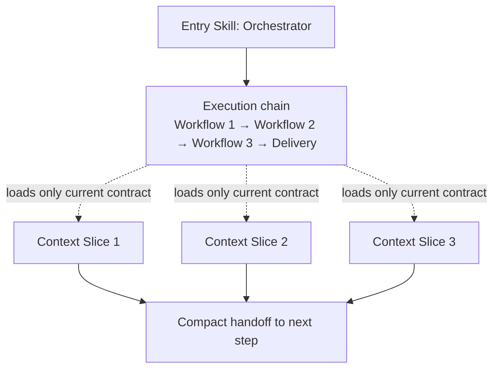

# Agentic Workflows Blueprint

A meta-skill that teaches your AI agent how to build operational skills
for each module and system in your project — so it loads only the context
it needs, when it needs it.

Instead of one massive `AGENTS.md`, your agent gets a routing system:
it classifies the task, loads the right skill, executes deterministically,
and hands off to the next step. Less tokens, more precision.

---

## Quick run

```bash
npx skills add devton/agentic-workflow-blueprint
```

Then call the agent in your target repository with a direct prompt like:

```text
blueprint this project.
```

After that, wait for the agent to finish the scaffold. The expected first
deliverable is the main project skill file at `skills/<projectSlug>/SKILL.md`.

---

## The problem it solves

You have a project with multiple modules. Your AI agent loads everything
every time — all rules, all context, all history. That burns tokens and
dilutes focus.

This blueprint lets the agent build **scoped skills per module**, each
with its own contract, inputs, outputs, and review gates. The agent
only loads what's relevant to the current task.

---

## How it works in practice

**Without this blueprint:**
You tell your agent "add a payment module". It loads your entire
AGENTS.md (500+ lines), guesses conventions, and wings it.

**With this blueprint:**

1. You trigger this skill once: *"set up my project"* — it asks a few
   questions and scaffolds `skills/<project>/` with routing, contracts,
   and workflows.
2. Next time you say *"add a payment module"*, the agent classifies the
   task → loads only `skills/<project>/workflows/modules/SKILL.md`
   → follows the deterministic procedure → passes the review gate
   → hands off.
3. You adjust any workflow in plain conversation — it's just markdown
   the agent reads and follows.

---

## Why this saves tokens

- **Scoped loading** — agent loads only the skill for the current step,
  not the whole project context.
- **Bounded contracts** — clear inputs, outputs, and pass/fail gates
  keep the agent deterministic.
- **Focused retries** — when something fails, the agent retries only
  the failed gate, not the entire conversation.
- **Structured handoffs** — steps communicate via defined inputs/outputs,
  not free-form context dumps.

---

## Why turn plans into skills

Plans are useful in chat, but they are ephemeral. Turning a technical plan into
skills makes execution repeatable:

- **Persistence** — workflows survive beyond a single session.
- **Determinism** — contracts replace vague "implement this" instructions.
- **Verification** — review gates turn plan acceptance criteria into pass/fail checks.
- **Routing** — the entry skill loads only the workflow needed for the current step.

Use the `plan-to-blueprint` workflow when you already have a plan and want the
agent to scaffold `skills/<projectSlug>/` with router commands and manifests.

---

## Blueprint vision



---

## Getting started

When you trigger this blueprint, the agent will ask:

- **projectSlug** — short name for the repo (e.g. `my-backend`)
- **baseBranch** — main integration branch (e.g. `main`, `develop`)
- **techStack** — what's the stack? (e.g. `NestJS + PostgreSQL + Redis`)
- **workflowsWanted** — which workflows to scaffold
  (e.g. `modules`, `specs`, `document`, `network-engineering`, `infra-operations`, `iac`, `os-platform`, `review`)
- **constraints** — hard rules
  (e.g. "no ORM, raw SQL only", "all API calls go through service layer")

Then it generates the full structure and wires everything into your
`AGENTS.md` or `CLAUDE.md` — no manual wiring needed.

### What gets generated

```
skills/<projectSlug>/
  SKILL.md                          ← Orchestrator (entry point)
  template.json                     ← Declarative command manifest
  reference/
    routing-matrix.md               ← Task → workflow mapping
    role-contracts.md               ← Roles, boundaries, handoffs
    hook-blueprint.md               ← Optional automation hooks
  workflows/
    <workflowName>/SKILL.md         ← One per workflow
    <workflowName>/template.json    ← Optional per-workflow manifest

docs/runbooks/
  agent-role-system.md              ← Operator-facing playbooks
  agent-role-hooks.md               ← Optional hook runbook
  plan-to-blueprint.md              ← Plan → skill scaffold playbook
```

### Skill manifest (`template.json`)

`SKILL.md` is the source of truth. `template.json` is a complementary manifest
for agents and tools that expose a command interface:

```json
{
  "name": "my-backend",
  "version": "1.0.0",
  "entry": "SKILL.md",
  "routing": "router-only",
  "commands": [
    {
      "name": "document",
      "description": "Build docs from implementation evidence",
      "skill": "workflows/document/SKILL.md"
    },
    {
      "name": "plan-to-blueprint",
      "description": "Turn a technical plan into executable project skills",
      "skill": "workflows/plan-to-blueprint/SKILL.md"
    }
  ]
}
```

Keep `commands[].name` aligned with workflow folder names and with the Command
routing section in the entry `SKILL.md`.

---

## Command routing

After scaffold, invoke internal workflows through the project entry skill
(router-only):

```text
/<skillName> document
/<skillName> review
/<skillName> plan-to-blueprint
/<skillName> iac
/<skillName> network-engineering
```

Chained intent in one message (agent resolves sequentially):

```text
/<skillName> document review changelog
```

**Fallback** when the agent does not parse subcommands: invoke `/<skillName>`
and pass the subcommand in the prompt, e.g. *"Run subcommand `document` using
the command routing in skills/my-backend/SKILL.md."*

---

## Included workflow examples

These are **templates** — copy, rename, and adapt to your project's
actual workflows (deploy, test, migrate, etc).

| Workflow | What it does | When to use |
|----------|-------------|-------------|
| `embed-aihero-radioactive` | Full 14-phase development lifecycle embedding Matt Pocock / AI Hero skills | Deep discovery, domain modeling & quality-gated delivery |
| `mattpocock/wayfinder` | Strategic codebase orientation & intent framing | Pre-discovery codebase mapping & entry point identification |
| `mattpocock/grilling` | Socratic grilling & assumption interrogation protocol | Requirement clarification, trade-off & edge-case stress testing |
| `mattpocock/domain-modeling` | Domain entity, aggregate, state transition & schema modeling | Core domain design & UUIDv7 schema specification |
| `mattpocock/research` | Technical research spikes, API feasibility & benchmarking | Assessing technical risks & third-party dependencies |
| `mattpocock/prototype` | Disposable proof-of-concept prototyping & visual spikes | Validating UI/UX or complex logic hypotheses before spec |
| `mattpocock/to-spec` | Converts discovery, domain models & spikes into actionable specs | Synthesizing task.md execution plans from upstream evidence |
| `radioactive` | Full 11-phase development lifecycle workflow | End-to-end features, refactors, and quality-gated delivery |
| `brainstorming` | Socratic discovery protocol & decision log | Requirement discovery & scope clarification |
| `plan-writing` | Structured task breakdown with dependencies & verification | Pre-implementation task planning |
| `ui-ux-pro-max` | Design system, palette, typography & responsive rules | Frontend UI/UX component design |
| `remotion-video-motion` | Remotion video setup, component motion, Zod schemas & spring choreography | Programmatic video generation, UI motion demos & GIF exports |
| `thermo-nuclear-code-quality-review` | Strict code quality & maintainability review | Code audit & architectural verification |
| `thermo-fix` | Automated review fix loop (up to 3×) with build check | Applying review findings & build verification |
| `html-manual` | Standalone single-file interactive visual HTML manual generator | Generating README.html & visual HTML docs for skills, runbooks, references |
| `changelog-generator` | Customer-facing release notes from git commits | Generating user changelog |
| `document` | Builds docs from git diff evidence | After implementation is done |
| `review` | Validates docs with deterministic pass/fail | Auto-step after `document` |
| `changelog` | Generates changelog from approved docs | After `review` passes |
| `linear` | Creates Linear projects/issues via MCP | Multi-PR initiatives |
| `mcp-linear-planner` | Preflight check + execution plan for Linear | When you need stricter control |
| `mcp-linear-sync` | Executes planned Linear operations | After `planner` validates |
| `network-engineering` | Captures network architecture and change controls | Topology changes, routing/firewall updates, connectivity validation |
| `infra-operations` | Standardizes infrastructure operations workflow | Capacity changes, patch windows, rollback-ready infra updates |
| `iac` | Governs Infrastructure as Code lifecycle | Terraform/OpenTofu plans, policy checks, drift handling |
| `os-platform` | Defines operating system baseline and hardening workflow | Linux/Windows hardening, patching, service baseline enforcement |
| `implementing-devsecops-security-scanning` | Builds full CI/CD security scanning with gates | When integrating Gitleaks, Semgrep, Trivy, SBOM, and optional ZAP |
| `scanning-containers-with-trivy-in-cicd` | Adds Trivy security gates in CI/CD | Blocking container promotion on severity policy violations |
| `scanning-docker-images-with-trivy` | Runs comprehensive Docker image scanning with Trivy | Image security checks, SBOM generation, and registry release validation |
| `scanning-kubernetes-manifests-with-kubesec` | Scans Kubernetes manifests with Kubesec | Static manifest security validation before deployment |
| `implementing-network-policies-for-kubernetes` | Enforces Kubernetes network microsegmentation | Default-deny policy rollout with explicit allow-list validation |
| `implementing-rbac-hardening-for-kubernetes` | Hardens Kubernetes RBAC model | Least-privilege access and cluster-admin sprawl reduction |
| `implementing-pod-security-admission-controller` | Rolls out Pod Security Admission safely | Namespace policy enforcement via audit/warn/enforce strategy |
| `securing-aws-iam-permissions` | Hardens AWS IAM access posture | Least-privilege IAM, boundaries, key hygiene, and continuous monitoring |
| `securing-container-registry-images` | Secures container artifact lifecycle in registries | Scan/sign/SBOM gates before image promotion |
| `securing-kubernetes-on-cloud` | Hardens managed Kubernetes clusters on cloud | Provider-aware controls across identity, network, RBAC, admission, and runtime |
| `triaging-vulnerabilities-with-ssvc-framework` | Prioritizes vulnerabilities with SSVC decision model | Converts CVE data into Act/Attend/Track outcomes with SLA mapping |
| `performing-kubernetes-cis-benchmark-with-kube-bench` | Audits cluster posture against CIS benchmark | kube-bench assessment, remediation prioritization, and drift tracking |
| `analyzing-kubernetes-audit-logs` | Detects threats from Kubernetes API audit events | Finds exec/secret/RBAC abuse patterns and produces SOC-ready detections |
| `securing-github-actions-workflows` | Hardens GitHub Actions supply-chain security posture | Enforces SHA pinning, least-privilege tokens, and safe workflow execution |
| `performing-container-image-hardening` | Hardens container images for production | Reduces attack surface with non-root, minimal base, and validation checks |
| `remediating-s3-bucket-misconfiguration` | Remediates exposed or weak S3 bucket configurations | Closes public access, enforces encryption/logging, and adds preventive guardrails |
| `performing-container-security-scanning-with-trivy` | Runs full-spectrum Trivy security scanning | Covers vuln/misconfig/secret/license scans and SBOM outputs |
| `performing-vulnerability-scanning-with-nessus` | Performs authorized Nessus vulnerability assessments | Produces validated findings and remediation-priority reports |
| `implementing-syslog-centralization-with-rsyslog` | Centralizes logs securely with rsyslog | Enforces TLS forwarding, resilient queues, and per-source routing |
| `c4-architecture` | Generates C4 architecture documentation | Produces context/container/component/deployment Mermaid diagrams |
| `plan-to-blueprint` | Converts a technical plan into project skills + manifests | After Plan mode or before multi-workflow implementation |

### Plan → blueprint example

```text
/<my-backend> plan-to-blueprint

Technical plan: [paste milestones, tasks, acceptance criteria, constraints]
Project: my-backend, baseBranch: main, techStack: NestJS + PostgreSQL
```

Expected output: `skills/my-backend/SKILL.md`, `template.json`, workflow
contracts under `workflows/`, and updated root doc links.

### Chained flow example (document → review → changelog)

```
attempt = 1
while attempt <= 3:
  doc = run(document)
  review = run(review, input=doc)
  if review.pass:
    run(changelog, input=doc)
    break
  attempt += 1
```

1. `document` produces docs from implementation evidence.
2. `review` validates against the evidence.
3. If fail → feed findings back to `document`, retry (max 3).
4. If pass → `changelog` generates the entry.

---

## The contract format

Every workflow is an executable contract the agent follows:

```
Goal        → 1 sentence: what this workflow does
Scope       → applies to / does not cover
Triggers    → file patterns + intent phrases
Inputs      → what the workflow needs
Invariants  → hard rules that cannot be violated
Procedure   → deterministic steps (evidence-driven)
Outputs     → what must be produced
Review gate → pass/fail checklist
References  → links to parent skill and related workflows
```

This format keeps each workflow self-contained, linkable, and bounded.
Agents don't need to reason over the entire project — they follow the
contract for the current step.

---

## Included runbooks

Runbooks are operator-facing execution playbooks (for humans managing
agent runs). Workflow SKILL files are agent-facing contract definitions.

- **`document-review-changelog.md`** — operational guide for the 3-step
  doc loop with retry logic.
- **`linear-mcp.md`** — operational guide for direct Linear workflow.
- **`mcp-linear-sync.md`** — operational guide for the planner → sync
  decomposition.
- **`plan-to-blueprint.md`** — operational guide for plan → skill scaffold.
- **`network-change.md`** — operational guide for controlled network changes.
- **`iac-delivery.md`** — operational guide for IaC plan/apply/policy flow.
- **`os-hardening-patching.md`** — operational guide for OS hardening and patch windows.

---

## How to use this repo

1. Read `SKILL.md` for the full blueprint procedure.
2. Trigger the skill in your agent with your project details.
3. The agent scaffolds the structure and wires it into your root doc.
4. Adjust workflows as needed — it's markdown, edit in conversation.
5. Add new workflows over time by following the contract format.

Stack-agnostic by design. Stack-specific rules (ORM patterns, testing
conventions, deployment quirks) go in the project skill and get linked
from individual workflows.

## References

- [Visual HTML Version](./README.html)
