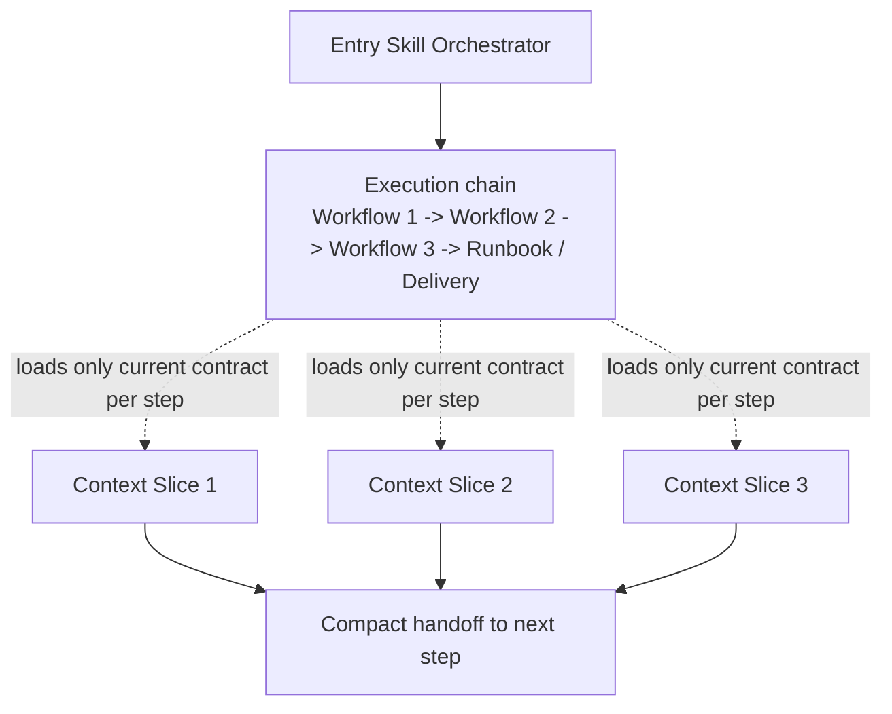
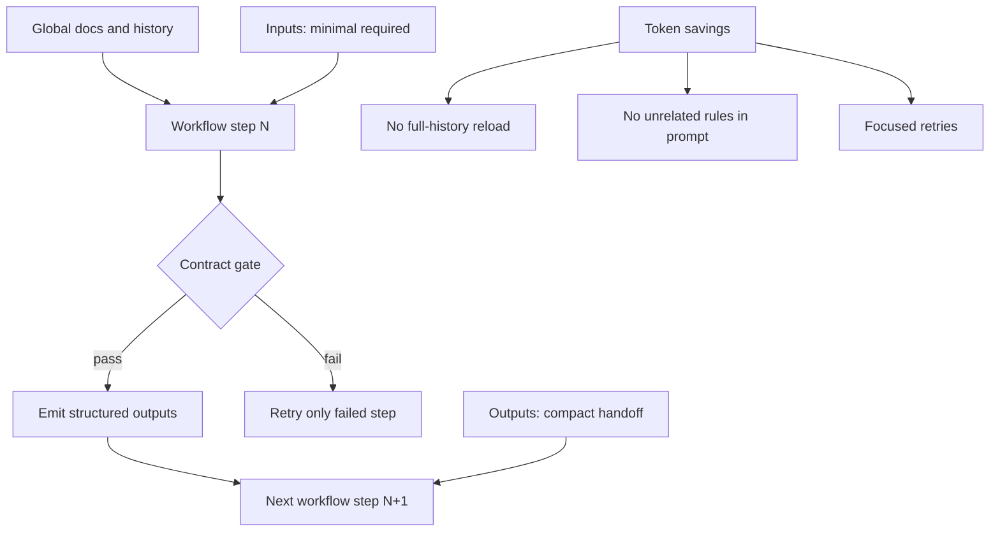

# Agentic Workflows Blueprint

This folder provides a reusable blueprint to scaffold an agent-oriented
documentation/workflow structure in any repository.

## Blueprint vision




## What to customize first

- `projectSlug`: the target repository name.
- `baseBranch`: integration branch (`main`, `develop`, etc.).
- `techStack`: short stack description.
- `constraints`: hard rules that cannot be violated.
- `workflowsWanted`: the workflow ids you want to scaffold.

## How to use

1. Read `SKILL.md` to understand the required contract format.
2. Create the project entry skill (`skills/<projectSlug>/SKILL.md`).
3. Create references (`routing-matrix.md`, `role-contracts.md`).
4. Create workflows under `skills/<projectSlug>/workflows/`.
5. Link everything from the root instruction file (`AGENTS.md`, etc.).
6. Verify all links and workflow ids.

## Included example workflows

This blueprint includes a direct Linear workflow example plus additional
composable examples under `workflows/`:

- `document`: builds/update docs from the implementation diff.
- `review`: validates document output and returns pass/fail feedback.
- `changelog`: writes a concise changelog entry after review passes.
- `linear`: concrete MCP workflow example for Linear integration.
- `mcp-linear-planner` (optional): validates MCP readiness and plans Linear actions.
- `mcp-linear-sync` (optional): executes synchronized updates from intake plan.

## Example chained flow (document -> review -> changelog)

Use this flow to demonstrate orchestration behavior:

1. Run `document`.
2. Run `review`.
3. If `review` fails:
  - rerun `document` with review feedback;
  - rerun `review`;
  - repeat up to 3 attempts total.
4. If review passes, run `changelog`.

Pseudo-flow:

```text
attempt = 1
while attempt <= 3:
  doc = run(document)
  review = run(review, input=doc)
  if review.pass:
    run(changelog, input=doc)
    break
  attempt += 1
```

## Goal of these examples

The objective here is to show a practical, composable workflow pattern. Teams
can keep this blueprint as reference and adjust naming, files, and gates to
their own project standards.

## Why contracts improve token efficiency

Contracts keep each workflow explicit and bounded (`Goal`, `Inputs`,
`Invariants`, `Procedure`, `Outputs`, `Review gate`). This improves token
efficiency because:

- the agent loads only the instructions relevant to the current step;
- execution avoids broad, repeated reasoning over unrelated rules;
- handoffs become structured (inputs/outputs) instead of free-form context;
- retries focus only on failed gates, not on the entire flow.

In practice, this reduces prompt bloat and makes runs more deterministic.




## MCP integration example (Linear)

Use `linear` as the default MCP example in this blueprint. It mirrors the
canonical project workflow style used in this repository:

Recommended usage:

1. Run `linear` to manage project/milestone/issue operations in Linear.
2. If you need stricter orchestration, split `linear` into:
  - `mcp-linear-planner` (preflight and plan),
  - `mcp-linear-sync` (execution and report).

This models both levels:

- simple and direct (`linear`);
- decomposed and highly controlled (`planner -> sync`).

## Included example runbooks

This blueprint also includes runbooks under `runbooks/`:

- `document-review-changelog.md`: operational guide for the 3-step doc loop.
- `linear-mcp.md`: operational guide for direct Linear workflow usage.
- `mcp-linear-sync.md`: operational guide for Linear preflight + sync split.

Use runbooks as execution playbooks (operator-facing), while workflow SKILL
files remain contract definitions (agent-facing).